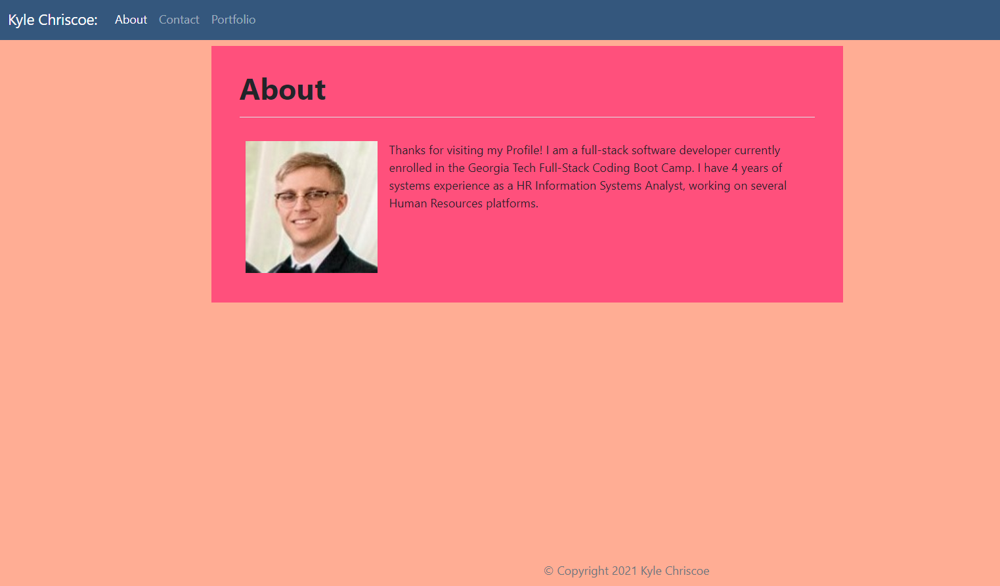

# Portfolio

## Description

Application to display my personal porfolio

Deployed Site: [https://udunomancer.github.io/portfolio](https://udunomancer.github.io/portfolio)

Site Repository: [https://github.com/Udunomancer/portfolio](https://github.com/Udunomancer/portfolio)

## Table of Contents
* [Usage](#usage)
* [License](#license)
* [Contributing](#contributing)
* [Tests](#tests)
* [Questions](#questions)

##  Usage

* User should be able to view three pages by navigating to the application at [https://udunomancer.github.io/portfolio](https://udunomancer.github.io/portfolio)
    * Contact Page with my personal information
    * About Page with details about me
    * Portfolio with projects I've completed

##  License

[The MIT License](https://opensource.org/licenses/MIT)

##  Contributing

No public contributions accepted in this repository at this time.

If issues are found, please contact me using email/GitHub profile found in the Questions section below.

##  Tests

To confirm functionality, visit site and confirm:
* that Contact, Portfolio and About pages load
* All links work

##  Questions

Have questions?
* View my GitHub Profile: [https://github.com/Udunomancer](https://github.com/Udunomancer)
* Email me at: [kyle717@gmail.com](mailto:kyle717@gmail.com)